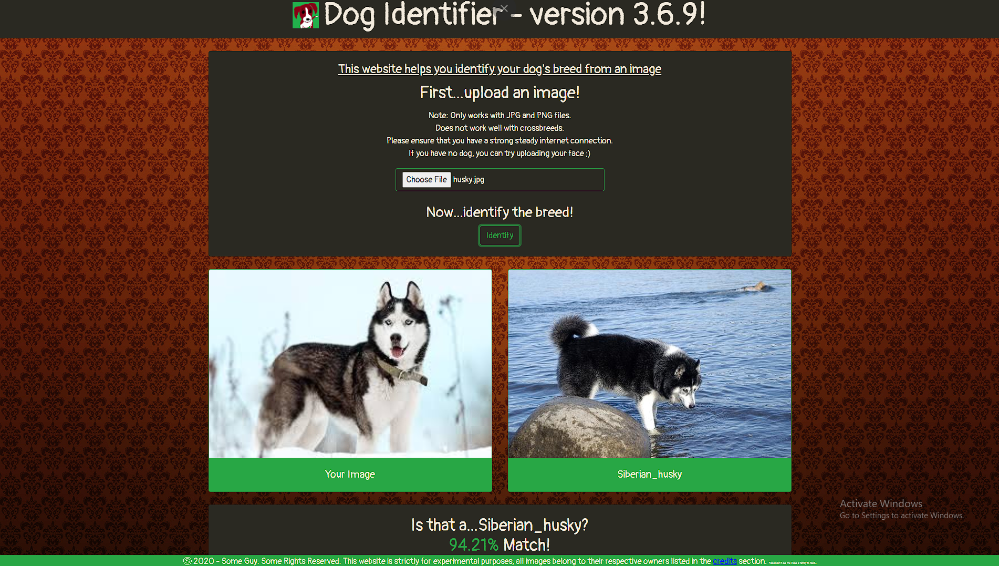
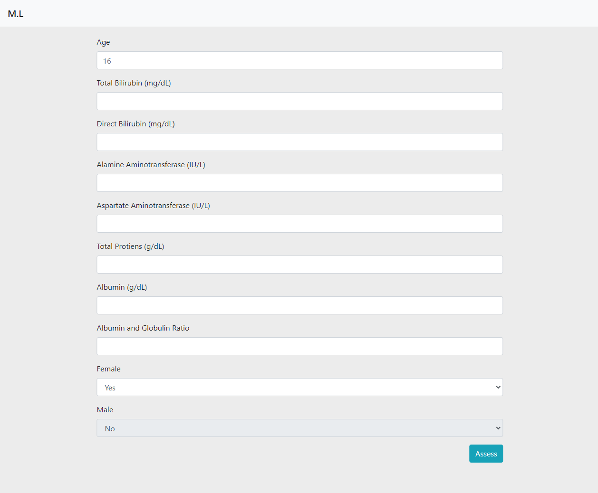

# TP-Machine-Learning-Projects
This repository contains previous projects done by some of the students from Temasek Polytechnic. Previously known as The ML Noobies, all the deployed projects have been linked here for easy management. We hope this will benefit future students and developers. The ML Noobies can be accessed at https://enigmatic-retreat-79157.herokuapp.com/

# Projects
## Dogsify
Dogsify is an image classification web application that is able to differentiate and identify the breed of a dog based on the image uploaded. It is developed with Keras and Tensorflow.

  * Project: https://dogsify.herokuapp.com/
  * Author: Owen Tan
  
## Liver Disease
This Liver Disease project is a machine learning project developed to predict the chance of a person having liver disease. It is developed with Scikit Learn and Kaggle dataset.

  * Project: https://lit-basin-19638.herokuapp.com/
  * Author: Mario Lim

